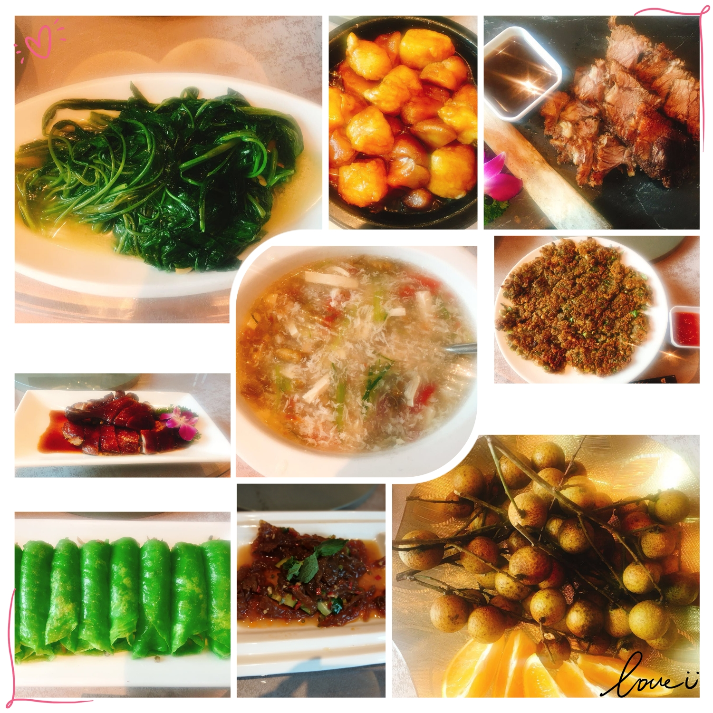
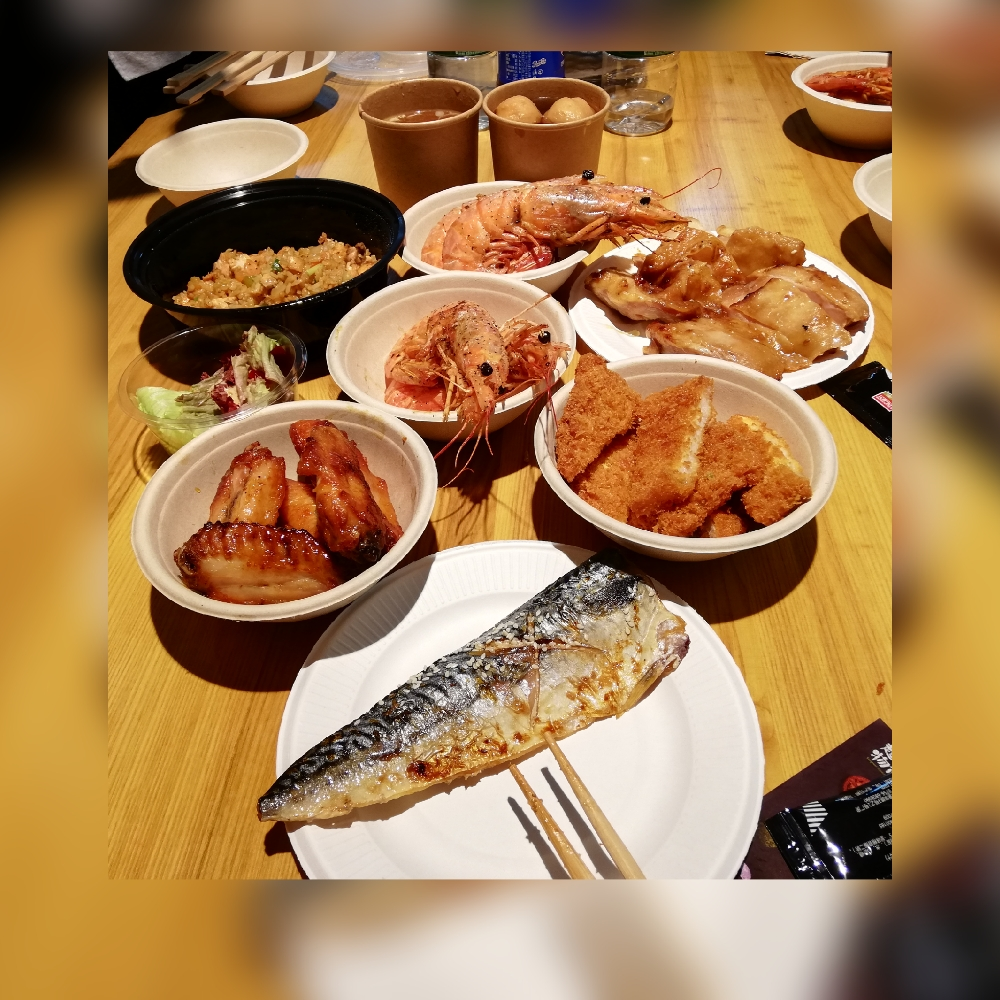
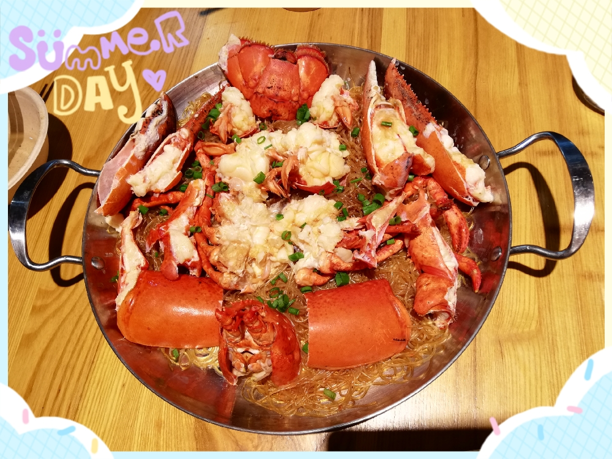
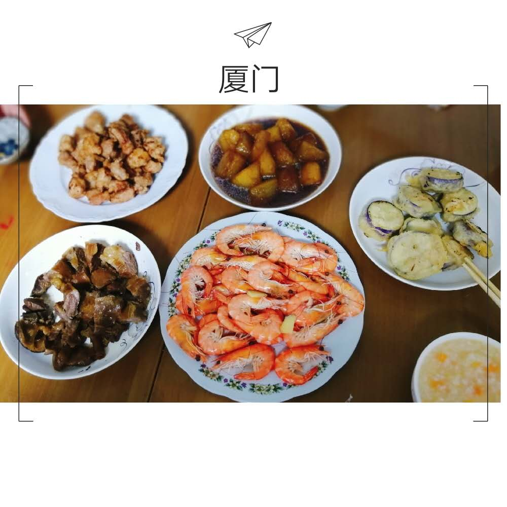
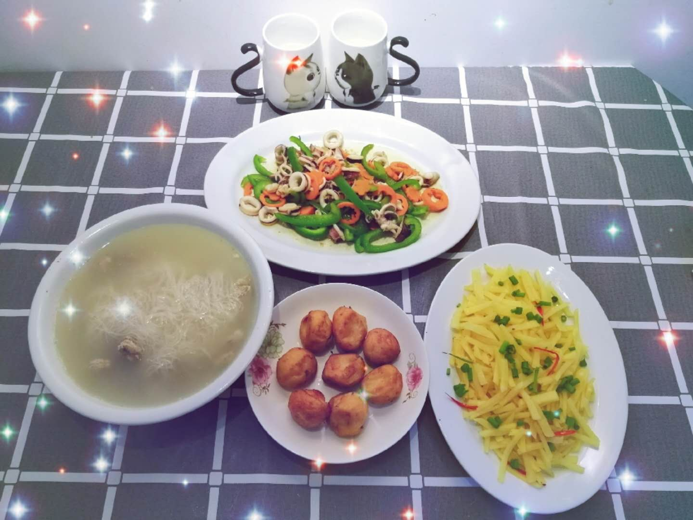
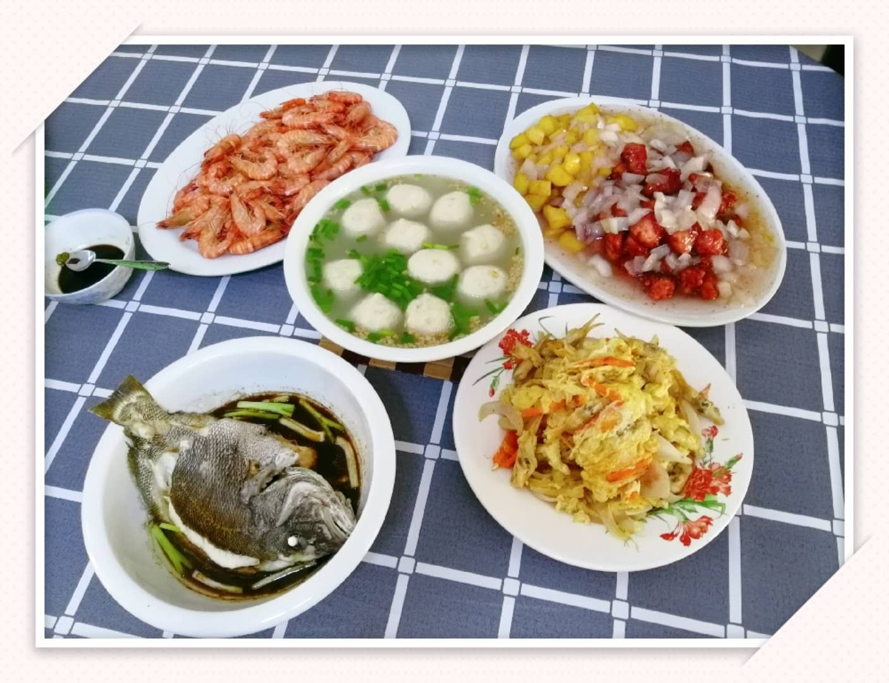
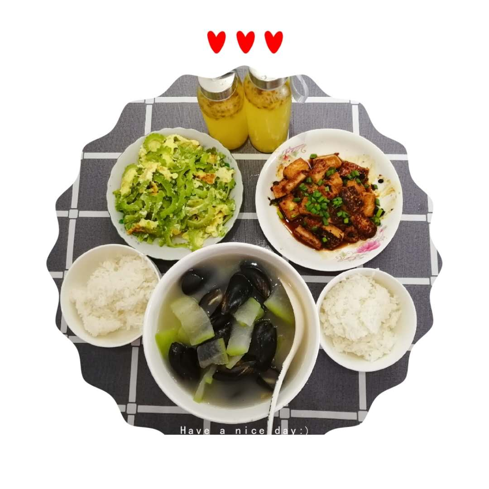
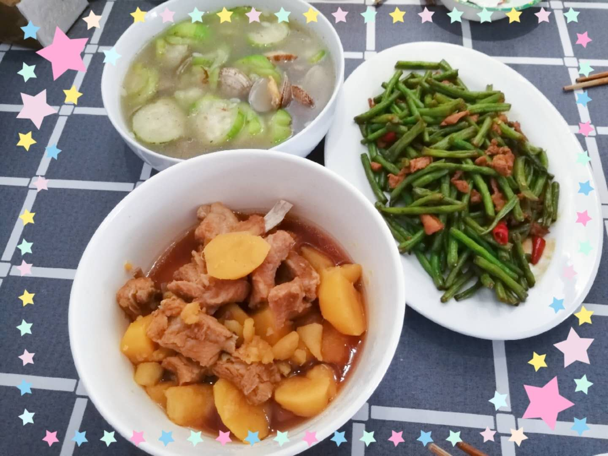
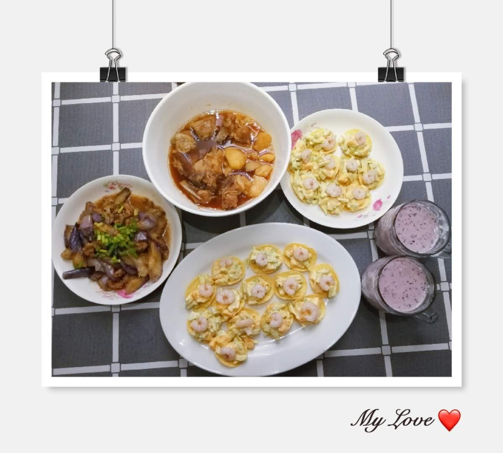
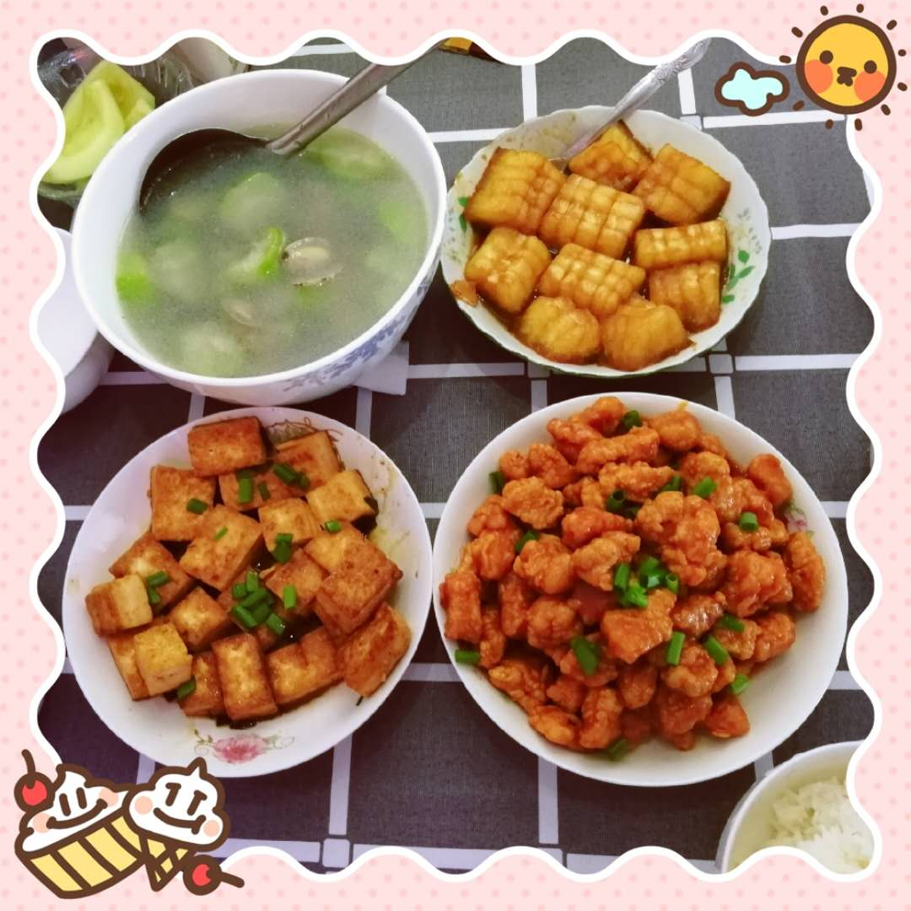

### 吃过的美食
#### 2018.08.26（思明区梅园酒店）
#### 评分：✨✨✨✨✨✨✨✨

#### 这一家做的菜，色香味俱全。
---

#### 2018.08.25（厦门双子塔）
#### 评分：✨✨✨✨✨✨✨✨

#### 现做的，非常新鲜的海鲜，特别是龙虾和大虾，特别美味，海鲜炒饭也不错。

---

#### 2018.08.24 (大哥准备的大餐）
#### 评分：✨✨✨✨✨✨✨✨

#### 老哥请假做的大餐，感动😊！
---

#### ***2018.07.28(老婆生日)***
#### 评分：✨✨✨✨✨✨✨✨

#### Happy birthday and I love you till I grow old.


---

#### 2018.07.08
#### 评分：✨✨✨✨

#### 美味可口的鱼饼，酸辣土豆丝，江小白加雪碧超好喝，结果和小姐姐一起喝醉了🤣。。。
---

#### ***2018.07.07（The engagement）***
#### 评分：✨✨✨✨✨ 

#### 小姐姐哥哥的杰作，不愧是陈大厨！
---
#### 2018.07.01
#### 评分：✨✨✨✨✨ 
##### 早上

#### 三明治，味道还行，吃了两大个，好撑。。。。。。
##### 中午

#### 冬瓜淡菜汤，味道鲜美，小姐姐真棒👍！由于早上吃得太撑，下午都不怎么饿，也没怎么吃😭。
---
#### 2018.06.30
#### [薯片牛油果大虾](http://mp.weixin.qq.com/s?__biz=MzA3MDI2MjIzNw==&mid=2650537107&idx=1&sn=30ed00c76114c08f6533e59fe7f1bd1e&chksm=8730d021b0475937f53c43abfb0e5138a250ab04c7909306452264e3564f3be1110f15f00cba&mpshare=1&scene=23&srcid=0629MrOB9I5X23WoLaJy9MUC#rd)
#### 评分：✨✨✨✨✨ 
##### 中午

#### 菜还行，排骨有点硬，哈哈。
##### 晚上

#### 茄子和薯片牛油果大虾超级赞👍，都吃完了，干干净净，不留一点痕迹，😄！
---
#### 2018.06.24 
#### [糖醋脆皮豆腐](https://mp.weixin.qq.com/s?__biz=MzA3MDI2MjIzNw==&mid=2650536903&idx=1&sn=cda34b75637856db09eb55ccc61090aa&chksm=8730d775b0475e63a1b1d25dbd5999f312889ea84e9ef4948e056896a68c0317b64904ecad95&mpshare=1&scene=23&srcid=0622mPz0VezbH2gsOa9us6S9%23rd)  
#### 评分：✨✨✨✨✨ 

#### 和小姐姐第一次一起做的四道菜，口感味道都非常赞👍。
